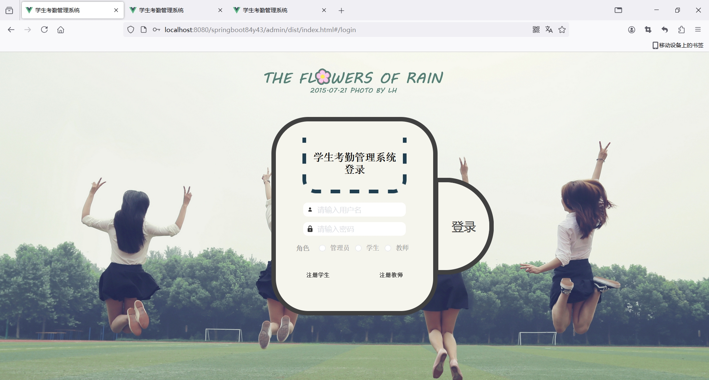
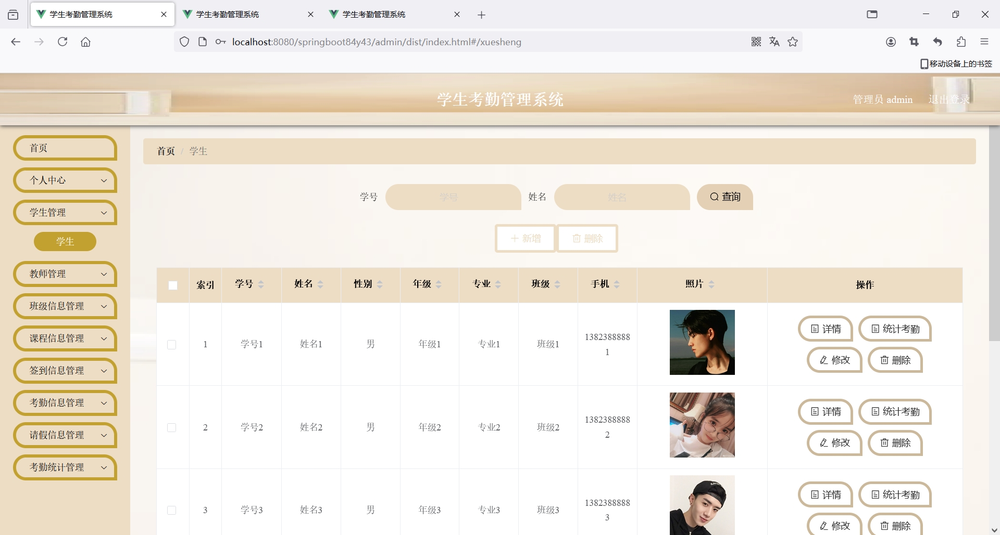
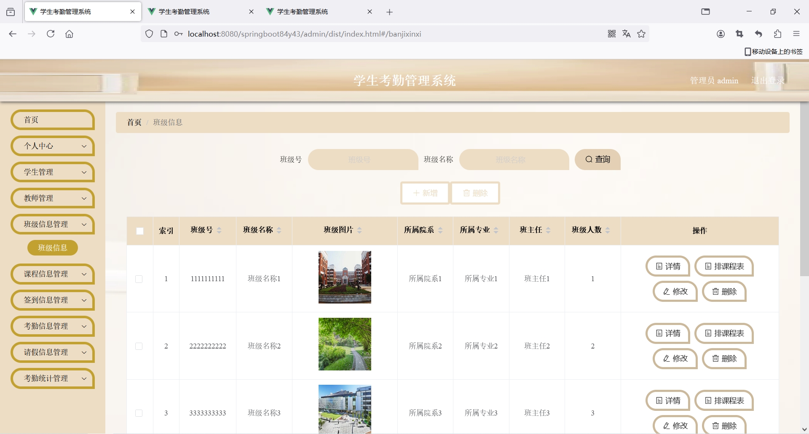
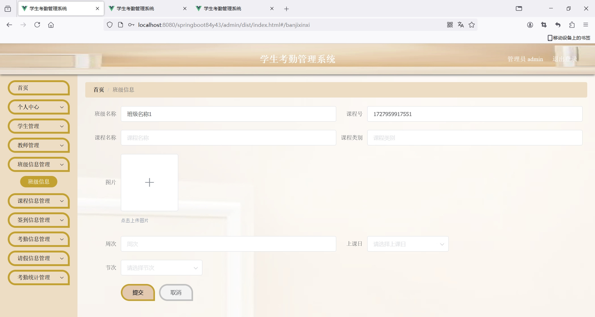
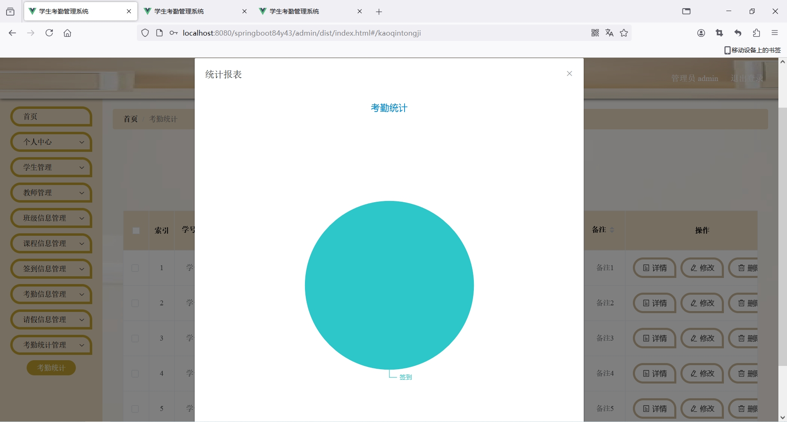
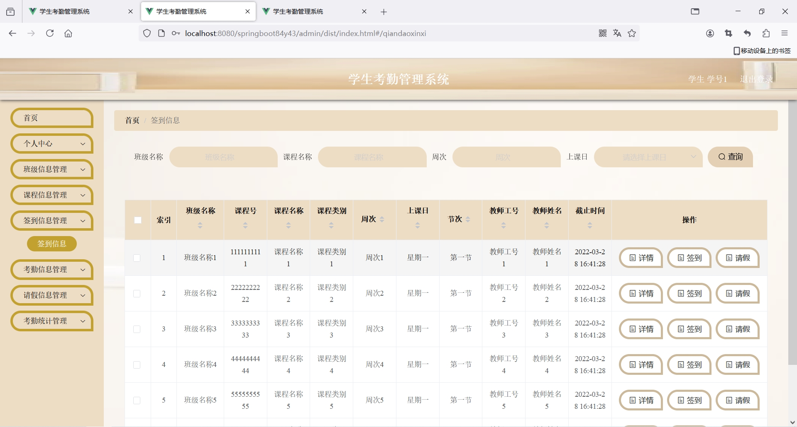
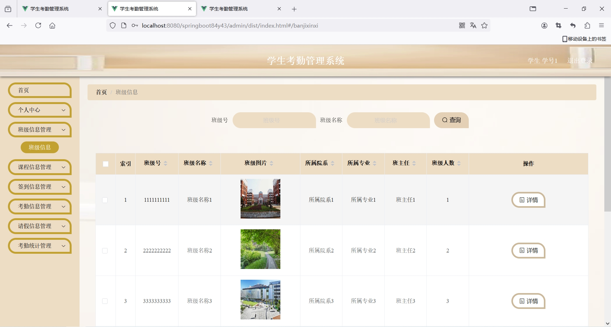

<h1 align="center">基于SpringBoot框架实现的学生考勤管理系统【带文档】</h1>

<h4> 完整代码获取地址：从戎源码网（https://armycodes.com/） </h4>
<h4> 作者微信：19941326836 QQ：605739993 QQ群：655392706 </h4>
<h4> 承接计算机毕设、Java毕业设计、Python毕业设计、深度学习、机器学习 </h4>
<h4> 选题+开题报告+任务书+程序定制+安装调试+论文+答辩ppt 一条龙服务 </h4>
<h4> 毕业设计所有选题地址：(https://github.com/Descartes007/allProject) </h4>

## 项目介绍

基于SpringBoot框架实现的学生考勤管理系统【带文档】：前端 vue、axios、elementui，后端 springboot、mybatis，系统角色分为：管理员、教师和用户，管理员在管理后台学生信息、教师信息、请假和考勤管理等；教师可以对学生的请假申请审批等；学生可以查看课表、签到、请假等。主要功能如下：

### 管理员

- 基础操作: 登录、获取个人信息、修改个人信息、修改密码
- 学生管理: 获取学生信息列表、查看学生信息详情、修改学生信息、删除学生信息、新增学生信息、筛选学生信息、统计考勤
- 教师管理: 获取教师信息列表、查看教师信息详情、修改教师信息、删除教师信息、新增教师信息、筛选教师信息
- 班级信息管理: 获取班级信息列表、查看班级信息详情、修改班级信息、删除班级信息、新增班级信息、筛选班级信息、排课表
- 课程信息管理: 获取课程信息列表、查看课程信息详情、修改课程信息、删除课程信息、筛选课程信息
- 签到信息管理: 获取签到信息列表、查看签到信息详情、修改签到信息、删除签到信息、筛选签到信息
- 考勤信息管理: 获取考勤信息列表、查看考勤信息详情、修改考勤信息、删除考勤信息、筛选考勤信息
- 请假信息管理: 获取请假信息列表、查看请假信息详情、修改请假信息、删除请假信息、筛选请假信息、审批
- 考勤统计管理: 获取考勤统计列表、查看考勤统计详情、修改考勤统计、删除考勤统计、筛选考勤统计、统计报表

### 教师

- 基础操作: 登录、注册、获取个人信息、修改个人信息、修改密码
- 学生管理: 获取学生信息列表、查看学生信息详情、筛选学生信息、统计考勤
- 班级信息管理: 获取班级信息列表、查看班级信息详情、筛选班级信息
- 课程信息管理: 获取课程信息列表、查看课程信息详情、修改课程信息、学生签到、筛选课程信息
- 签到信息管理: 获取签到信息列表、查看签到信息详情、筛选签到信息
- 考勤信息管理: 获取考勤信息列表、查看考勤信息详情、筛选考勤信息
- 请假信息管理: 获取请假信息列表、查看请假信息详情、筛选请假信息、审批
- 考勤统计管理: 获取考勤统计列表、查看考勤统计详情、删除考勤统计、筛选考勤统计、统计报表

### 学生

- 基础操作: 登录、注册、获取个人信息、修改个人信息、修改密码
- 班级信息管理: 获取班级信息列表、查看班级信息详情、筛选班级信息
- 课程信息管理: 获取课程信息列表、查看课程信息详情、修改课程信息、筛选课程信息
- 签到信息管理: 获取签到信息列表、查看签到信息详情、筛选签到信息、签到、请假
- 考勤信息管理: 获取考勤信息列表、查看考勤信息详情、筛选考勤信息
- 请假信息管理: 获取请假信息列表、查看请假信息详情、筛选请假信息
- 考勤统计管理: 获取考勤统计列表、查看考勤统计详情、筛选考勤统计、统计报表

## 环境

- <b>IntelliJ IDEA 2020.3</b>

- <b>Mysql 5.7.26</b>

- <b>Maven 3.6.3</b>

- <b>JDK 1.8</b>

## 运行截图

